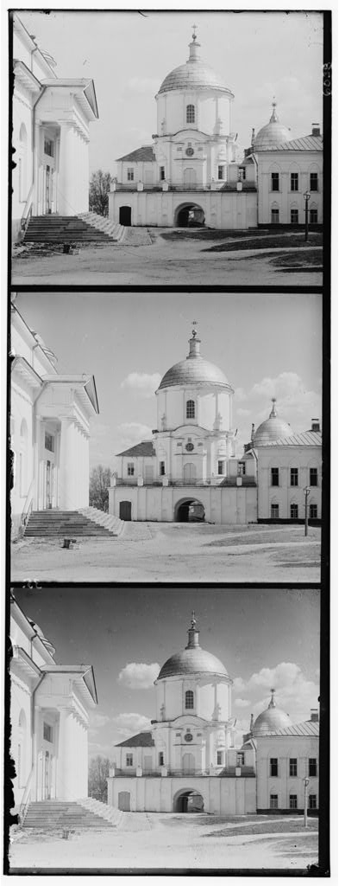
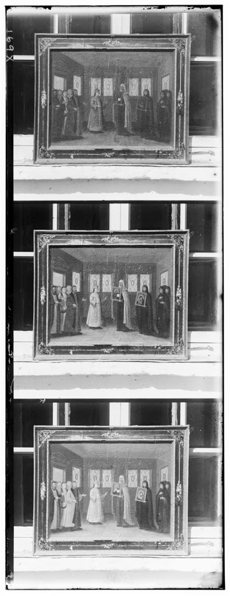
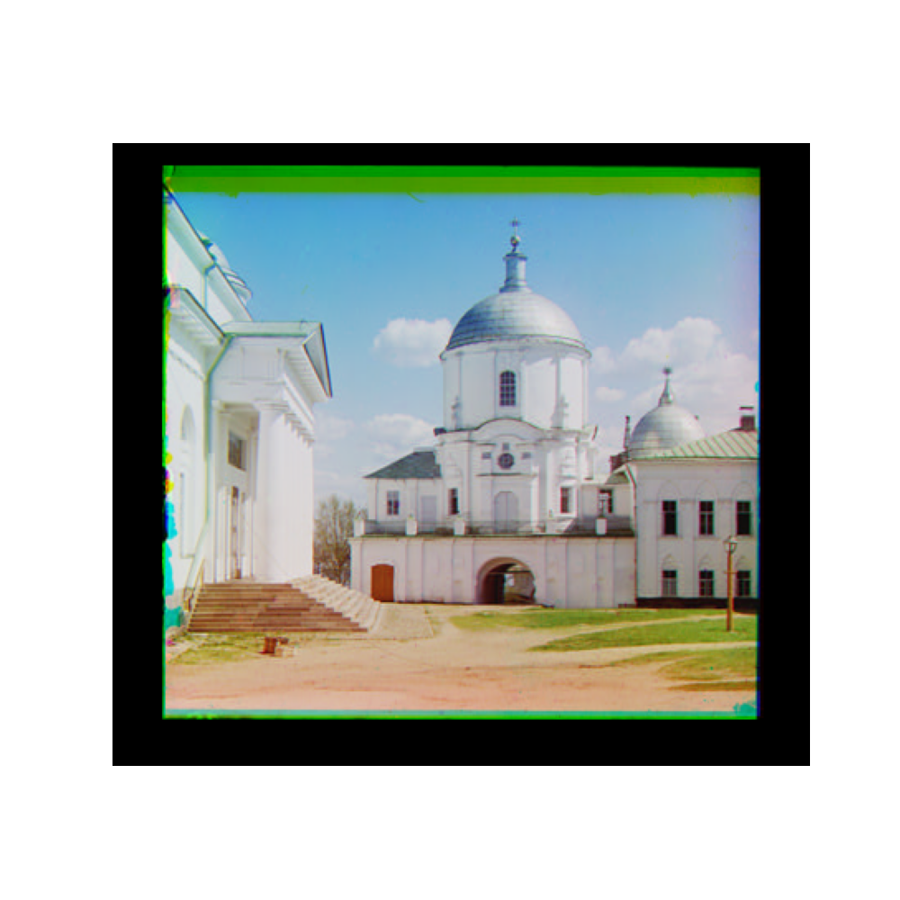

# Image Colorization and Morphological filtering based Instance Segmentation

<p align="center">
  
</p>

[](LICENSE)
[](https://github.com/username/project/actions)

## Description
1. **_PartA_:**
  Educational Code that implements Image colorization from scratch by first cropping 3 images of different channels from a single image, aligns them using Normalized Cross Correlation (NCC) and then combines them in different permutations to give the final RGB Image.

2. **_PartB_:**
  Educational Code that implements Instance Segmentations of multiple well separated objects within an image. The first part of the process is to perform [Otsu's thresholding](https://en.wikipedia.org/wiki/Otsu%27s_method) to get a first segmentation of the objects. Then, morphological filtering is performed to fill any holes/gaps and refine edges. Finally, a Connected-Components Algorithm returns the separated object instance masks.
 


## Table of Contents
- [Part A](#Part_A)
  - [Frame Detection](#frame-detection)
  - [Template Matching and Normalized Cross Correlation (NCC)](#template-matching-and-normalized-cross-correlation-ncc)
- [Installation](#installation)
- [Usage](#usage)
- [Screenshots](#screenshots)
- [Contributing](#contributing)
- [License](#license)

## Part_A

### Frame Detection

The input images are of the following form:

<p align="center">
  
  
  
</p>

The borders coordinates are detected using pixel-value histograms along dimensions x and y. The coordinates are then saved so that we can perform appropriate cropping

### Template Matching and Normalized Cross Correlation (NCC)

After having cropped the images we perform zero-padding and we get the matching coordinates by finding the maximum NCC score while sliding one image on top of the other across x-y axes.

For a given alignment the NCC metric is given by:

<div align="center" style="font-size: 20px;">

$$
NCC = \sum_{i=1}^{W} \sum_{j=1}^{H} \frac{I_1(i, j) - \mu_1}{\sigma_1} * \frac{I_2(i, j) - \mu_2}{\sigma_2}
$$

</div>

### Results

Having found the matching image coordinates we append them together to from a single RGB 3-Channel Image. A sample results is as follows:

<p align="center">
  
</p>

## Installation

To install the dependencies, run:

```bash
pip install -r requirements.txt
